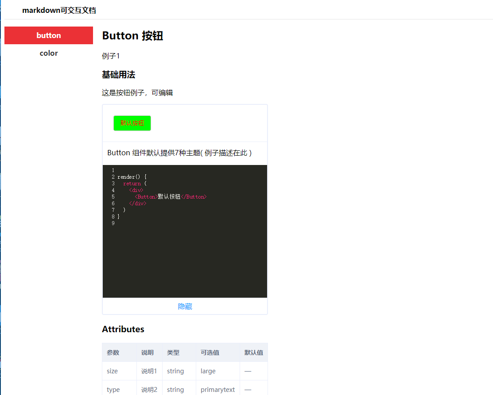

# docs-markdown

markdown文档搭建工程

### 使用

```bash
npm install

npm start
```

### 目录结构
```js
src\

  css\                  // css文件

  img\                  // 图片文件
  
  docs \                // md文档

  pages \               // 文档页面
 
  util\                 // 工具

app.js                  // 入口

### 效果
